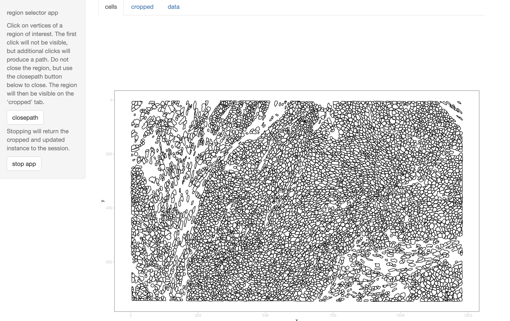
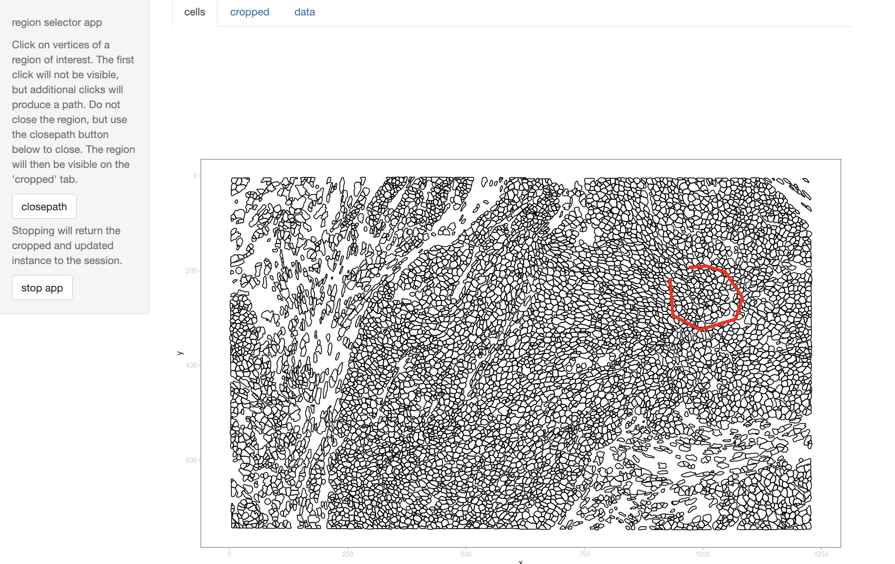
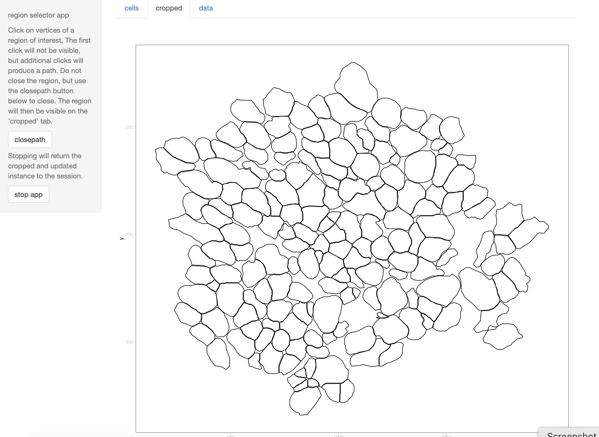

# SpatialData.apps

This package defines `crop_spd_app` that can be used
to interactively select subregions of SpatialData instances.

Install with `BiocManager::install("vjcitn/SpatialData.apps")`.

`example(crop_spd_app, ask=FALSE)` will start the app.  The
sidebar panel explains operations.  You have the opportunity to
use mouse clicks to define a region of interest.  The "closepath"
button will close the path described by the clicks and update
the object to include new 'shape' and 'table' elements corresponding
to the cropping selection.

If you have never used `SpatialData.data::Breast2fov_10x`, the associated
data will be retrieved and cached.

Initial view:


After 8 clicks:


After closepath:


```
class: SpatialData
- images(1):
  - morphology_focus (5,3529,5792)
- labels(2):
  - cell_labels (3529,5792)
  - nucleus_labels (3529,5792)
- points(1):
  - transcripts (1113950)
- shapes(4):
  - cell_boundaries (7275,circle)
  - cell_circles (7275,circle)
  - nucleus_boundaries (7020,circle)
  - pick (174,circle)
- tables(2):
  - table (280,7275)
  - pick (280,174)
coordinate systems:
- global(7): morphology_focus cell_labels ... nucleus_boundaries
  transcripts
```

Different components of example datasets have different values that
must be supplied for the app to succeed.  The table below shows how
`shape_feature_name` and `table_feature_id` should be set for use with
different example datasets in SpatialData.data.
```
> app_support
                   funname shapeind tabind shape_feature_name table_feature_id
1      MouseIntestineVisHD        2      2        location_id      location_id
2             Lung2fov_10x        1      1  __index_level_0__          cell_id
3           Breast2fov_10x        1      1  __index_level_0__          cell_id
4        MouseBrainMERFISH        2      1            cell_id          cell_id
5 JanesickBreastXeniumRep1        1      1  __index_level_0__          cell_id
6 JanesickBreastXeniumRep2        1      1  __index_level_0__          cell_id
```

